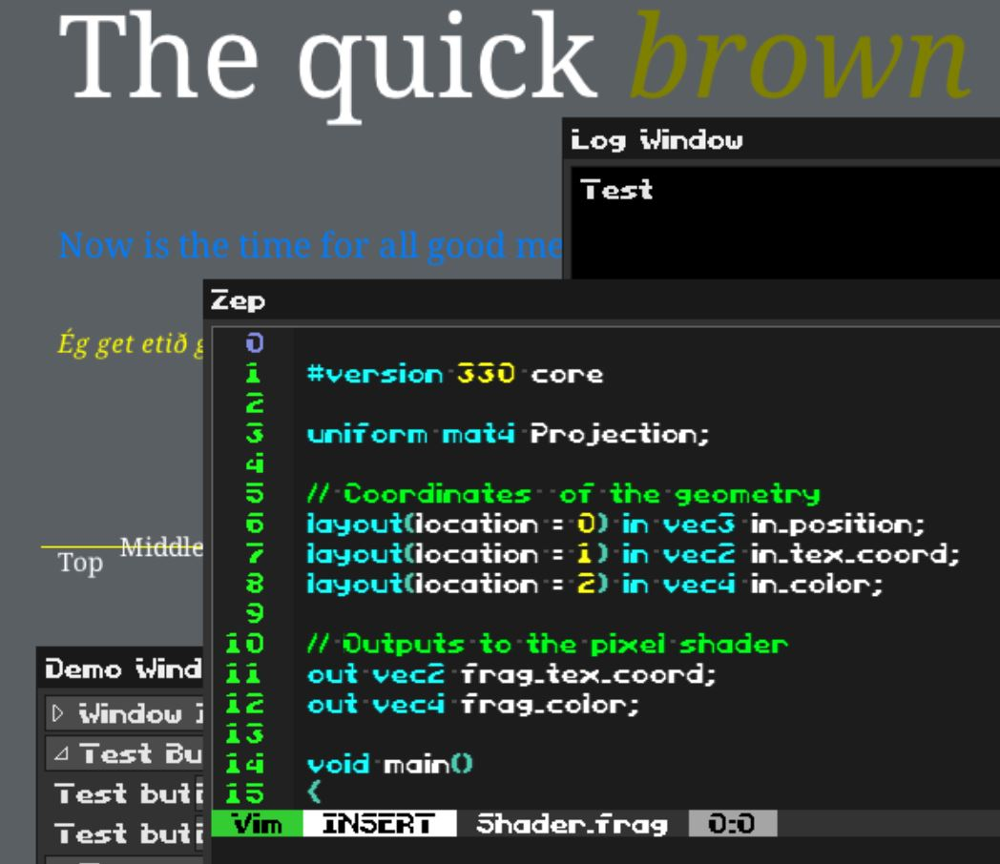

# LabFont



This project is an exploration of getting text into a rendering pipeline.
Frameworks such as Dear ImGui solve text
rendering well, but are bound into their overall framework scheme; it's
not easy to use Dear ImGui's font rendering outside of GUI rendering, for
example to draw in-game text, or use text as an effect in a particle system.

LabFont therefore combines stb_truetype and fontstash as a starting point, and
wraps the minutiaea of using it in a simple interface with not much more
utility than loading a TTF format font, and rendering it via a selected
graphics API.

It also adds support for loading bitmapped fonts laid out according to 
QuadPlay's conventions, and allows for rendering of those as well.

LabFont supports state baking, so that font rendering isn't a large chunk
of code with discrete state setting; a baked state encapsulates size, spacing,
color, and a number of other attributes so that rendering text can be as simple
as

```c
// returns first pixel's x coordinate following the drawn text
float LabFontDraw(const char* str, float x, float y, LabFontState* fs);
```

As a proof of concept, @rxi's microui
has been refactored to draw via LabFont and demonstrated with QuadPlay
fonts and TTF fonts. @rezonality's Zep vim emulator has been ported to
LabFont as well, and then Zep embedded in microui to demonstrate
that all these systems with different font rendering requirements can
interoperate without interfering with each other.

Originally, LabFont was implemented via sokol-gl, and that was pretty nice.
I got it into my head though, that I wanted an immediate mode drawing API to
draw rectangles and what not, so I generalized the system to allow the 
interleaving of text and 2d drawing without needing to swap out shaders.
sokol-gl didn't allow for that though, with its hard coded shader, and so I
reworked things, and now the sokol backend has reverted to work-in-progress.

Now, the fully functional backend is Apple Metal. sokol and Vulkan are work in
progress at a low priority, because I don't need them right now, and nobody is
asking for them. That will change in the future, I expect.


##Acknowledgements

This project combines elements of several libraries, 
thanks to their respective authors!

- https://github.com/memononen/fontstash
- https://github.com/nothings/stb
- https://github.com/floooh/sokol
- https://github.com/rxi/microui
- https://github.com/rezonality/zep
- https://github.com/Tencent/rapidjson
- https://github.com/morgan3d/quadplay (bitmapped font layout) 

